# 原理图规范

## 命名规范
### 命名规则
命名格式：信号类型 + 网络名称 + 作用对象

电源正极 DVCC3V3_MCU、VBUS24V、AVCC3V3_ADC

电源负极 GND_MCU、PGND、AGND_ADC
### 区分A、D模拟数字 

模拟信号是连续信号，其本身电压不会突变，检测模拟信号需要其电压稳定，而数字信号是不断跳变的电压信号，其电路电压本身会持续存在噪声信号，如果不分隔AD，数字电路会影响模拟电路的输入输出产生电磁干扰

### 区分VCC VBUS AREF

VCC表示IC的主要工作电压网络，需要稳定

VBUS表示IC电流输送网络，由DCDC产生，电压自带干扰噪声一般不能用于IC供电

AREF表示模拟电压参考信号，不供电只做参考，不需要大电流，但是需要极其稳定

### 电源回路
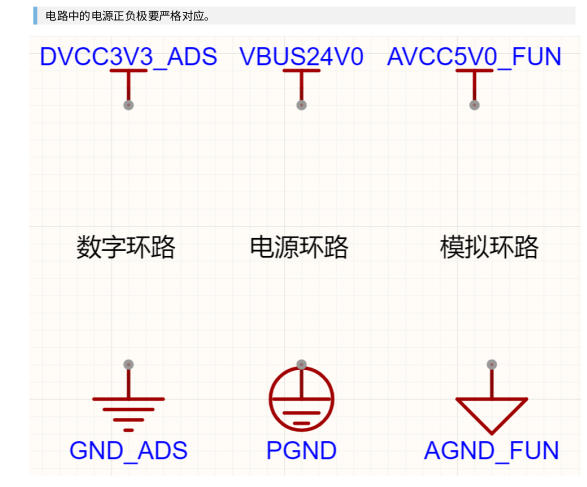

## 1. 电源规范

### 1.1. 总线电源输入-VBUS输入-分配PGND

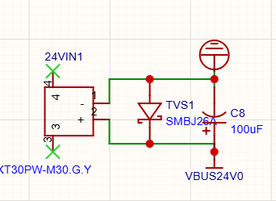
* TVS：可以防止浪涌电压
* C8：输入电容，对输入电压做缓冲，没有的话，下级DCDC非常容易炸

### 1.2. DCDC转换-VBUS输入-VBUS输出-分配PGND

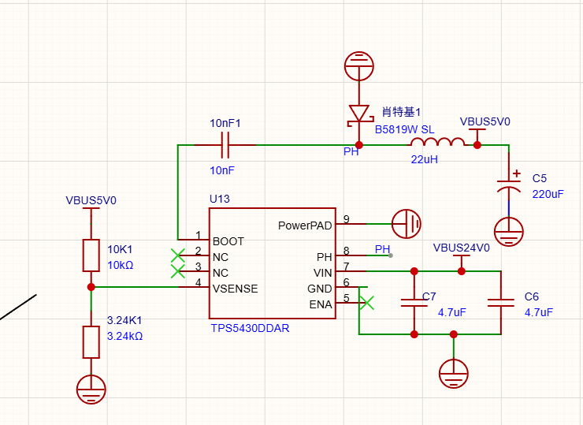
* 24V到5V电压转换，VBUS到VBUS的转换，不能直接用于IC工作电压

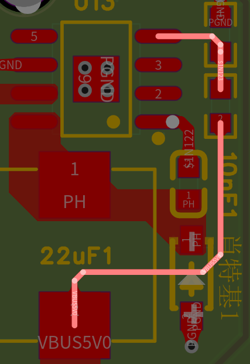
* 反馈电路一定要有及时性，从电感内侧出来直接回到反馈分压电路

### 1.3. 整体的隔离电源模块
* 转换24—+-12：根据功能分配在陀螺仪板中给模拟电路供电所以是AGND，隔离电源输出的电源有良好的稳定性可以和LDO功能类比，用来隔离干净的电源

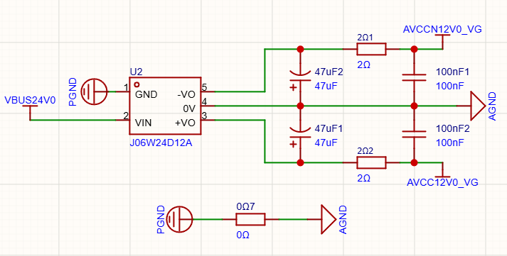
### 1.4. LDO模块
* 隔离出DVCC3V3_MUC电平和对应的数字地GND，这个是给MCU和CAN分出来的
* 0R一定和这个LDO放在一起

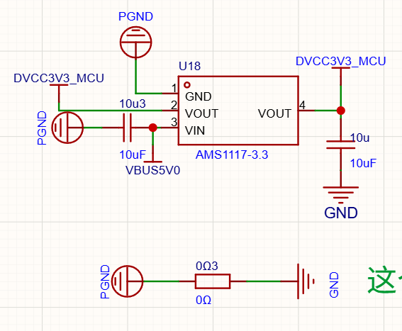

* 给ADS芯片分出来的

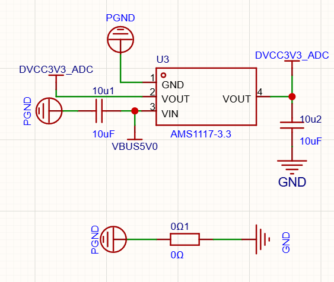

### 1.5. EMI滤波器
* 相当于性能强的RC LC滤波器，给VG910芯片提供稳定的5V数字电源隔离出VG的供电数字地

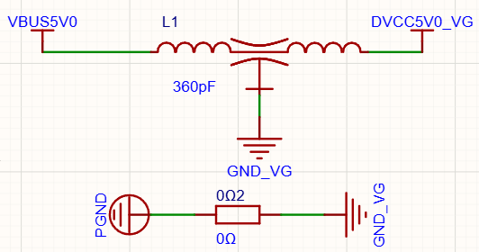

### 1.6. 参考电压输出
* 这种专门来产生参考电压的芯片一般产出的电压比较稳定也可以类比LDO做隔离使用，隔离出的2.5V参考电压一般都会出现在模拟电路中所以分配AGND

* 这里顺便把VBUS5V0用一个简单的RC滤波为后面电压跟随器提供一个相对稳定的工作电压

> 参考电压用AREF+电压_FUN，例如AREF1V94_ADC，表示AREF模拟参考电压1.94V用于ADC芯片

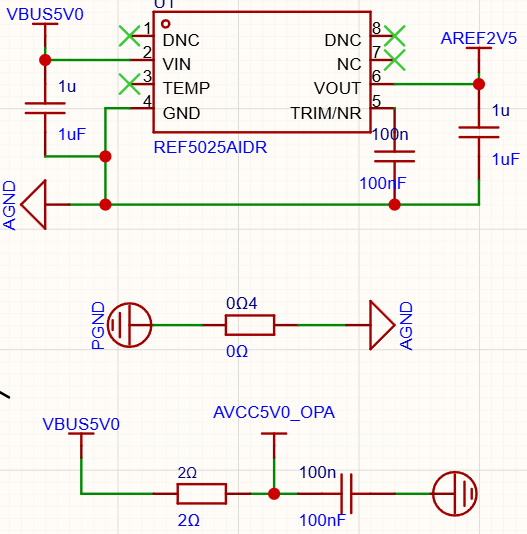

### 1.7. 电压跟随器，用来稳定电压，将输出端电压稳定在输入参考值

* 这里跟随的是AVCC，分配模拟地AGND和模拟电源
* 这里将2.5V的参考电压做了隔离，跟随器可以用自己的主电源对两路输出AREF2V5_ADC,AREF2V5_AD分别做跟随，两路互不干扰。

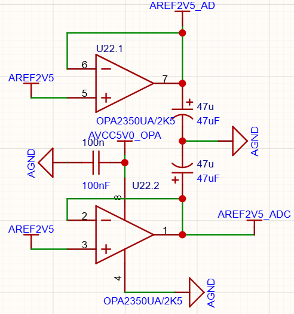

### 1.8. RC滤波
* 分别用一个简单的RC滤波给外接的码盘，光电传感器，ADS芯片隔离一个稍微稳定的5V电源，一般的模块内部会进行5VLDO降压到工作电压

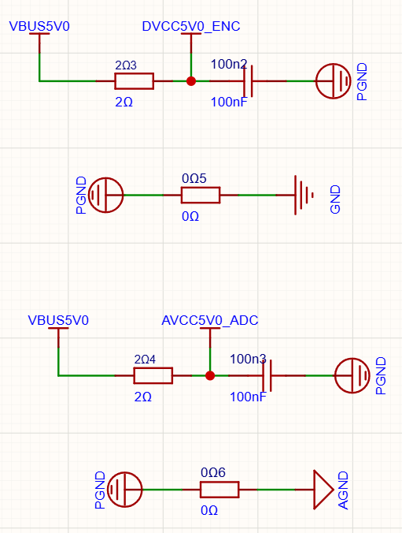

## 2. MCU规范

* 不用的引脚用X标记
* 在每一个VDD引脚附近放一个去耦电容，电流先流进电容再进芯片
* MCU分配数字地GND电源用数字电源DVCC
* SWD调试口电源 电源供给给生成MCU电平上层5V电源BUS

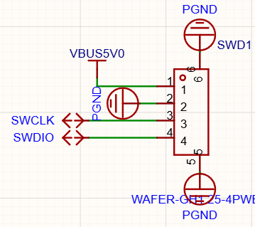

* 串口电源一样用适配的BUS电源供电

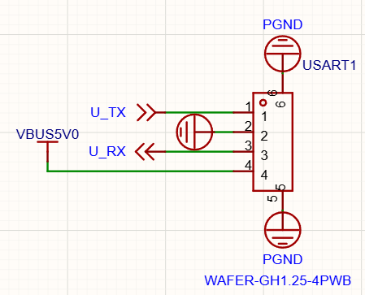

## 3. 数字信号规范

- 码盘光电编码器输入AB数字信号分配GND，根据数据手册选择供电大小
  > 这里供电VBUS5V0但是VBUS由DCDC产生不允许直接给IC供电需要经过RC简单滤波
  
  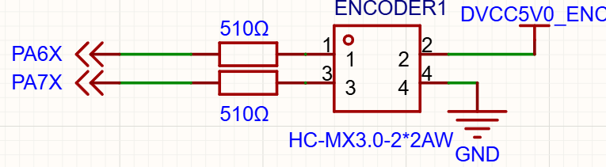
- CAN总线信号TTL数字信号分配GND，根据数据手册选择供电
  > 供电DVCC3V3_MCU只有一个CAN芯片这里直接和MCU共用一个隔离电源，接口固定引脚最外层地，这里是PGND。
  
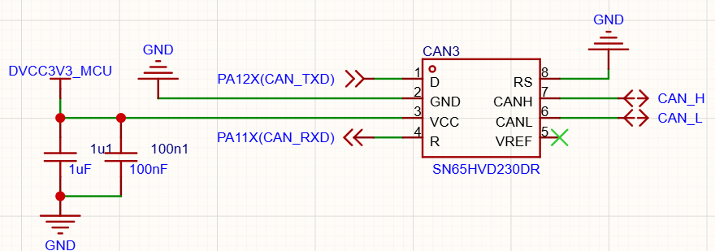
  
## 4. 模拟信号输入处理规范
- VG910接口输入信号为模拟信号本来应该分配AGND，但是VG910内部将输出信号分为VGOUTPUT_AGND和VGPUTPUT，组成差分对剩下的一个GND是内部隔离之后的数字地所以分配GND，为了不破坏差分对也分配GND_VG
  > N表示负电平电压N12V0表示-12V
  
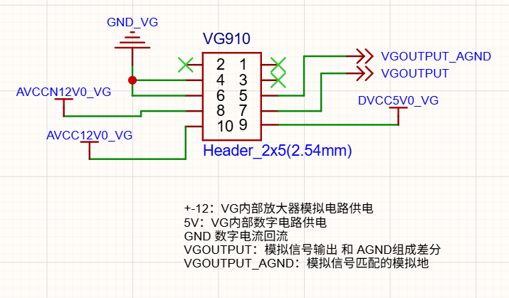
- 差分放大器对输入信号进行增益转换，因为处理的是模拟信号所以分配模拟电源和AGND
  
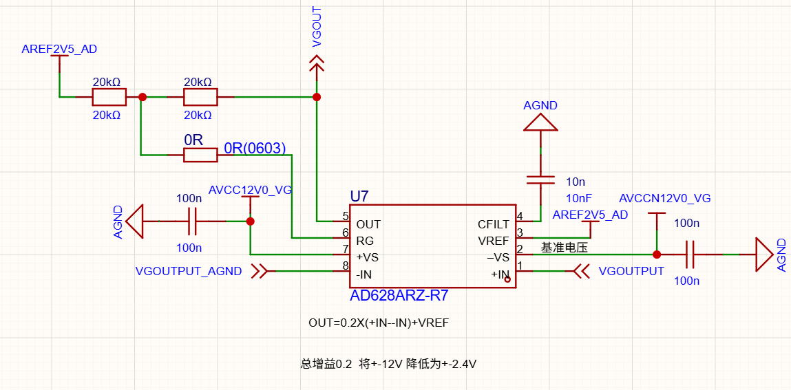
- ADS采样芯片负责将模拟信号离散化，用数字信号输出数字量，根据引脚定义分配地和电源
  
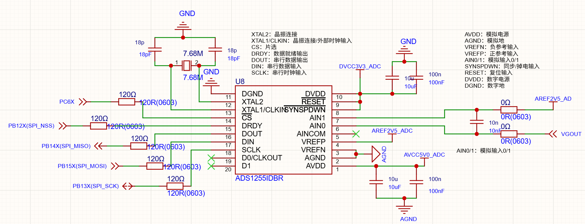
  

# PCB规范

## 1. 布线顺序

1. 模拟信号区域（信号线->模拟地->VCC电源）
2. 高速数字信号（信号线->VCC电源->数字地）
3. 电源区
4. VBUS在POW层走线 铺铜
5. 一些无关紧要的布线
6. 给GND层的PGND网络打缝合孔，间距mil
7. 添加泪滴，添加完之后所有的铺铜都要重建
8. 可以把GND层的铺铜重复到顶层和底层，由内圈向外圈
9. 检查DRC
10. 调整丝印，把接口名称放大看清楚，然后把接口引脚线序放在背面，首字母就可以
    > 丝印可以隐藏元件属性打板子的时候过滤掉，根据交互式bom查看元器件位置

## 2. 注意事项

### 2.1. 固定焊盘上要打过孔，防止焊盘被扯掉，但是元件焊盘上避免打孔
### 2.2. 电源正极几个过孔GND就几个过孔
### 2.3. 接口的电源正极朝里GND朝外
### 2.4. 方框这里留一些位置，过孔会阻隔其他层的电流通路
### 2.5. 把最外层的gnd 这里是PGND  安全间距里面把铺铜到边框的距离改为>=30mil

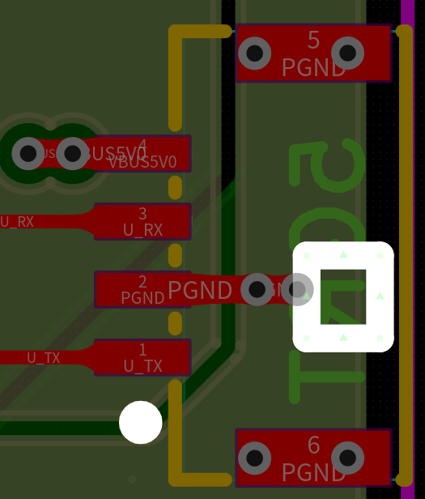
  
### 2.6. MCU的VDD引脚附近必须有一个电容去耦
  
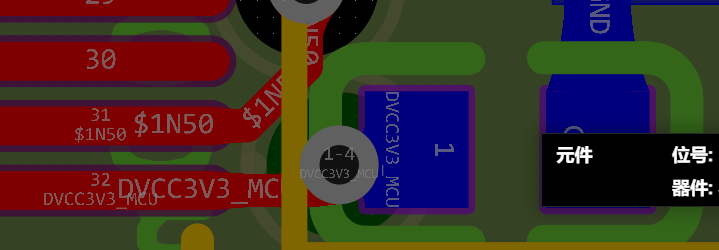
### 2.7. 电流一定先流过电容再流进IC
  
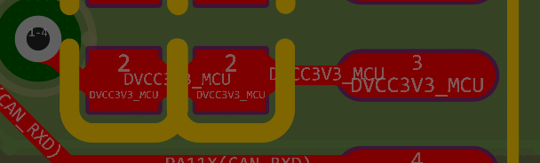

### 2.8. 用来隔离的0R电阻一般多引出一根线打孔连接
  
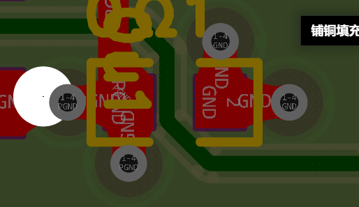
### 2.9. GND铺铜的时候一定要把顶层和底层对应的信号收进去，例如一根模拟信号线的正下方对应的地是AGND

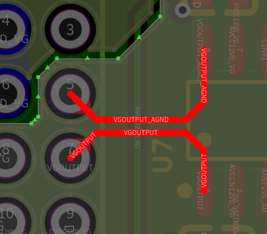
### 2.10. 参考电压优先当成信号处理
### 2.11. 优先把SDA，CLK这类信号先走再CS,TTL这类的信号可以打孔穿插
### 2.12. 信号层不走线的区域若都是电源，电源直接走在元器件这一层最好
### 2.13. 输入电流一定要先流进储能电容再流进IC
  
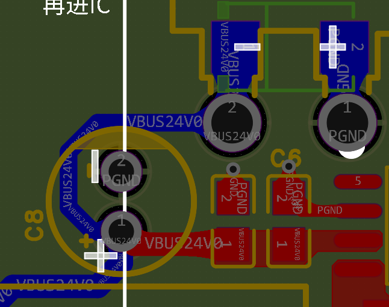
### 2.14. 从POW层向其他层引出供电时过孔数量要考虑实际电流大小
  
